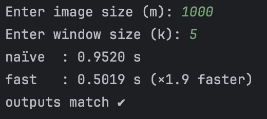

# Sliding-Window Max-Pooling

An implementation of the **k × k sliding-window maximum** on an m × m
matrix (image).  
Only **NumPy** and the Python standard library are used.

| File              | Contents                    | Worst-case Time |
|-------------------|-----------------------------|-----------------|
| `max_pool_naive.py` | baseline algorithm (recomputes each window) | Θ(m² k²) |
| `max_pool_fast.py`  | optimised two-pass deque algorithm          | Θ(m²)    |
| `demo.py`           | lets you pick *m* and *k*, runs both versions, prints runtimes and checks that the results match | — |

---
## Output


## How to run

```bash
pip install numpy          # one-time install
python demo.py             # then follow the prompts
